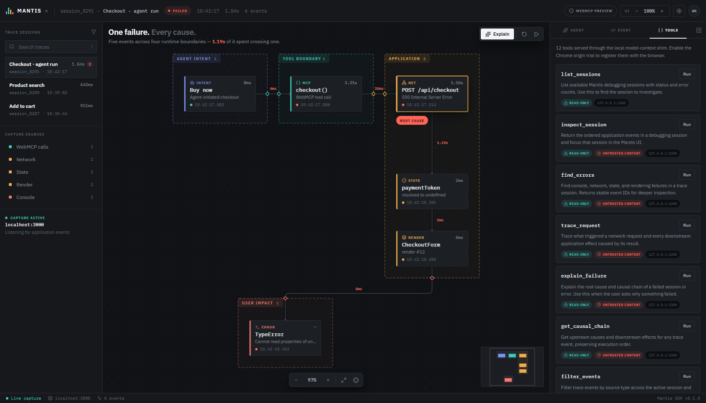
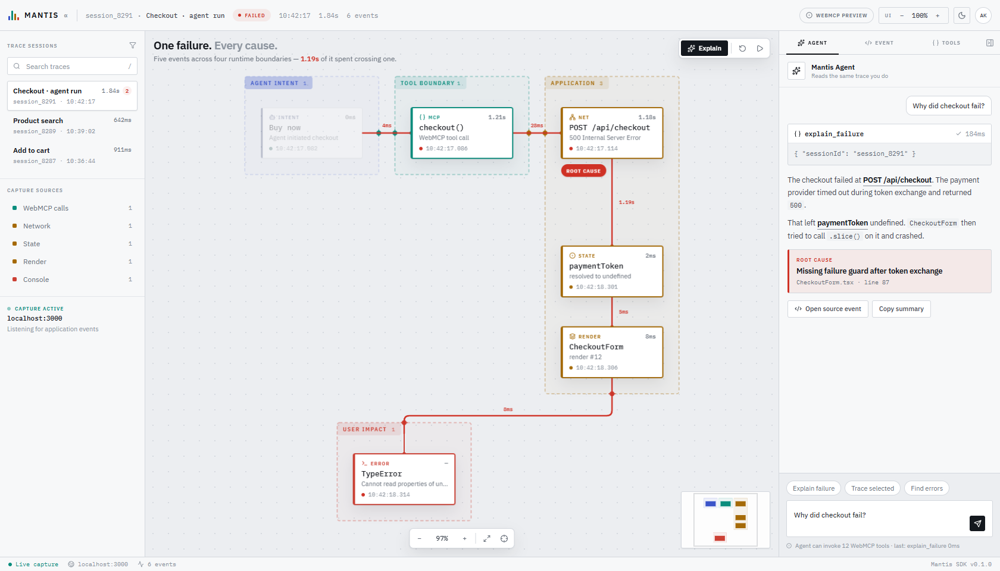

<div align="center">

# Mantis

### A shared debugging environment for humans and agents

**[▶ Live demo](https://flowtrace-mu.vercel.app)** · [WebMCP tools](#the-webmcp-surface) · [How the integration works](#how-the-integration-works) · [Evals](#evals)

[](#the-webmcp-surface)
[](#evals)
[](LICENSE)

</div>

---

When an agent breaks your app, it can see its own tool call and nothing else. The
network request it triggered, the state that went undefined, the component that
crashed — all invisible. You get a screenshot and a shrug.

Mantis turns disconnected browser telemetry into one causal graph. Developers get
a spatial canvas; agents get the exact same trace through WebMCP.

```text
WebMCP checkout() → POST /api/checkout → HTTP 500
                  → paymentToken undefined → CheckoutForm crash
```


## The idea

Mantis's claim is that it correlates causality **across runtime boundaries**, so
the canvas draws those boundaries as physical enclosures. Every hop that crosses
one punches through the enclosure wall at a marked **port**, carrying the latency
of that crossing. Boundary-crossing stops being a label and becomes something you
can see.

Colour follows the boundary, not the event type: a temperature ramp from agent
intent (cool) to user impact (hot), so a failure literally arrives at the warm
end of the canvas.

## The WebMCP surface

Twelve tools registered through `document.modelContext`, split by what they are
allowed to do.

### Read-only — `readOnlyHint: true`

| Tool | Purpose |
| --- | --- |
| `list_sessions` | Find available trace sessions |
| `inspect_session` | Return all ordered events in a session |
| `find_errors` | Find failures and their stable event IDs |
| `trace_request` | Trace a request from its trigger through downstream effects |
| `explain_failure` | Return a structured root-cause explanation |
| `get_causal_chain` | Get upstream causes and downstream effects for any event |
| `filter_events` | Filter by network, console, WebMCP, state, render, or user events |
| `inspect_webmcp_call` | Inspect an agent tool call and everything it triggered |

### Writes UI state — `readOnlyHint: false`

| Tool | Purpose |
| --- | --- |
| `select_event` | Open an event in the inspector so human and agent look at the same thing |
| `set_source_filter` | Set or clear the capture-source filter |
| `frame_trace` | Fit the causal graph to view, or restore the authored layout |
| `replay_session` | Step the canvas through a session so the failure unfolds |

An agent can drive the workspace, not just read it.

Every tool whose result is built from captured console or network payloads also
carries `untrustedContentHint`. That data is authored by the page under test, not
by Mantis, and downstream consumers should treat it accordingly.

A **declarative** tool is registered too: the trace search box carries `toolname`,
`tooldescription` and `toolparamdescription`, so the browser can drive the form
directly.



The **Tools** tab reads live from `getTools()` and refreshes on `toolchange`, so
it shows what the browser actually has registered rather than what this repo
intends. Each tool displays its annotations and can be run from the panel.

## How the integration works

The core lives in [`src/webmcp.ts`](src/webmcp.ts). Results come back in the MCP
envelope — a `content` array the model reads, plus `structuredContent` carrying
the payload:

```ts
return {
  content: [{ type: "text", text: "Root cause: POST /api/checkout returned HTTP 500…" }],
  structuredContent: { rootCause: { eventId: "req_checkout_42", code: "PAYMENT_PROVIDER_TIMEOUT" } }
};
```

Tools register with an `AbortController` so they unregister cleanly, and `execute`
receives a signal so long calls can be cancelled:

```ts
await document.modelContext.registerTool(tool, { signal: controller.signal });
```

**The application is a client of its own tools.** Nothing in the UI reaches into
the module directly — every action goes through discovery and execution, the same
path an agent takes:

```ts
const tool = (await modelContext().getTools()).find((t) => t.name === "explain_failure");
await modelContext().executeTool(tool, { sessionId: "session_8291" });
```

Execution emits a shared focus event, which is what keeps the two views in step:

```ts
window.dispatchEvent(new CustomEvent("mantis:focus", {
  detail: { ids: ["req_checkout_42", "state_payment_07", "error_type_01"], source: "explain_failure" }
}));
```

Write tools emit `mantis:command`, which the canvas applies — that is how an
agent moves your view.

### Enabling WebMCP in the browser

WebMCP is behind an origin trial in Chrome 149. Register your origin at the
[WebMCP origin trial](https://developer.chrome.com/origintrials/#/register_trial/4163014905550602241)
and paste the token into the commented `<meta http-equiv="origin-trial">` tag in
[`index.html`](index.html). The status chip then reads **WebMCP live** with the
registered tool count.

Without a token, Mantis serves the identical surface — `getTools`, `executeTool`,
annotations and all — through its own model-context shim, and the chip reads
**WebMCP preview**. The application behaves the same either way; only the
registration target changes.

## Evals

[`tests/webmcp-evals.spec.ts`](tests/webmcp-evals.spec.ts) follows Chrome's
[eval guidance](https://developer.chrome.com/docs/ai/webmcp/evals). An agent only
ever sees the descriptor and the result, so both are checked through the
model-context surface rather than by importing the module:

- every tool is discoverable with a usable descriptor and schema
- read and write tools are labelled honestly, and untrusted payloads are marked
- the 500 / 150 / 1.5K description, parameter and output budgets hold
- bad input returns a tool error rather than crashing
- write tools actually move the interface

```bash
npm test      # 24 tests
```

## The rest of the interface

- **Spatial canvas** — pan, zoom, and drag nodes. Enclosures are derived from the
  nodes they hold, so dragging a node grows its boundary instead of escaping it,
  which keeps the wall crossings the ports are drawn from honest.
- **Light and dark themes** that follow the OS until you pick one, then remember.
- **Interface scale** (`Alt +` / `Alt −` / `Alt 0`) resizing the whole shell,
  separate from the canvas zoom, re-framing the trace when it changes.
- Responsive down to mobile, visible keyboard focus, reduced motion respected.



## Run locally

Requires Node.js 20 or newer.

```bash
npm install
npm run dev
```

For a production check:

```bash
npm run build
npm run preview
```

## Try the demo

1. Open the failed `Checkout · agent run` session.
2. Press **Explain** — the causal chain lights up across four runtime boundaries.
   The long vertical run is the 1.19s the payment provider spent stalling.
3. Open the **Tools** tab and run a tool. Watch a write tool move the canvas.
4. Drag a node and see its enclosure grow to follow it.

In any browser, the same tools are reachable from DevTools:

```js
await window.mantis.invoke("explain_failure", { sessionId: "session_8291" });
```

For the native path, use ChatGPT's in-app browser or Chrome 149 with WebMCP
enabled, then ask the browser agent to list and inspect Mantis sessions.

## Architecture

```text
Application telemetry
        ↓
Normalized TraceEvent graph
        ├──→ React canvas (human view)
        └──→ document.modelContext tools (agent view)
                       ↓
              mantis:focus / mantis:command
                       ↓
              synchronized selection
```

| File | Role |
| --- | --- |
| [`src/webmcp.ts`](src/webmcp.ts) | Tool definitions, registration, the MCP envelope, the shim |
| [`src/useWebMCP.ts`](src/useWebMCP.ts) | React binding: registration lifecycle, discovery, `toolchange` |
| [`src/canvas.ts`](src/canvas.ts) | Pan, zoom-about-cursor, node dragging, fit-to-view |
| [`src/layout.ts`](src/layout.ts) | Derived enclosures, right-angle routing, boundary ports |
| [`src/data.ts`](src/data.ts) | The trace itself — the seam a real capture SDK would replace |

The hackathon slice uses a deterministic ecommerce trace so the whole story is
reproducible. The data boundary is isolated in `src/data.ts`, ready to be
replaced by a browser SDK or a streamed capture source.

## Stack

React 19, TypeScript, Vite, Lucide icons, Playwright, and the browser-native
[WebMCP API](https://webmachinelearning.github.io/webmcp/).

## License

[MIT](LICENSE)
