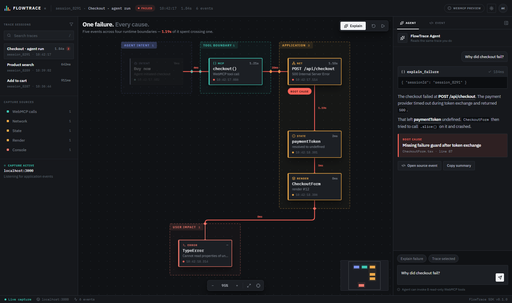

# FlowTrace

### A shared debugging environment for humans and agents

FlowTrace turns disconnected browser telemetry into one causal graph. Developers get a visual timeline; AI agents get structured, read-only WebMCP tools over the exact same trace.



When an agent calls `explain_failure`, FlowTrace returns machine-readable causes and simultaneously focuses those events in the UI:

```text
WebMCP checkout() → POST /api/checkout → HTTP 500
                  → paymentToken undefined → CheckoutForm crash
```

## What is working

- Interactive causal graph spanning agent intent, WebMCP, network, state, render, and console events
- Synchronized agent/UI focus through stable event IDs and `flowtrace:focus` browser events
- Eight real WebMCP tools registered with `document.modelContext.registerTool`
- Built-in checkout-failure demo with replay, source filters, event inspection, and agent explanation
- Read-only tool annotations and strict JSON Schemas
- Browser-safe preview API for environments where experimental WebMCP is unavailable
- Light and dark themes that follow the OS until you pick one, then remember the choice
- A spatial canvas you can pan, zoom, and rearrange: runtime boundaries are drawn as enclosures, and dragging a node grows its boundary rather than escaping it
- Boundary ports — every hop that crosses a runtime boundary punches through the enclosure wall at a marked port, carrying the latency of that crossing
- Responsive, keyboard-focusable developer interface

## WebMCP tools

| Tool | Purpose |
| --- | --- |
| `list_sessions` | Find available trace sessions |
| `inspect_session` | Return all ordered events in a session |
| `find_errors` | Find failures and their stable event IDs |
| `trace_request` | Trace a request from its trigger through downstream effects |
| `explain_failure` | Return a structured root-cause explanation |
| `get_causal_chain` | Get upstream causes and downstream effects for any event |
| `filter_events` | Filter by network, console, WebMCP, state, render, or user events |
| `inspect_webmcp_call` | Inspect an agent tool call and everything it triggered |

The core integration lives in [`src/webmcp.ts`](src/webmcp.ts). Tool execution emits a shared focus event:

```ts
window.dispatchEvent(new CustomEvent("flowtrace:focus", {
  detail: {
    ids: ["req_checkout_42", "state_payment_07", "error_type_01"],
    source: "explain_failure"
  }
}));
```

## Run locally

Requires Node.js 20 or newer.

```bash
npm install
npm run dev
```

Then open `http://localhost:5173`.

For a production check:

```bash
npm run build
npm run preview
```

## Try the demo

1. Open the failed `Checkout · agent run` session.
2. Select events in the graph to inspect their structured metadata.
3. Choose **Ask agent to explain** or **Run investigation**.
4. FlowTrace invokes `explain_failure({ sessionId: "session_8291" })`.
5. Watch the agent response and causal graph focus on the same events.

In a browser without WebMCP support, the same tools are available from DevTools for development:

```js
await window.flowTrace.invoke("explain_failure", {
  sessionId: "session_8291"
});
```

For native testing, use ChatGPT's in-app browser or enable WebMCP testing in Chrome at `chrome://flags/#enable-webmcp-testing`, then ask the browser agent to list and inspect FlowTrace sessions.

## Architecture

```text
Application telemetry
        ↓
Normalized TraceEvent graph
        ├──→ React visual debugger (human view)
        └──→ document.modelContext tools (agent view)
                       ↓
                flowtrace:focus
                       ↓
             synchronized selection
```

The current hackathon slice uses a deterministic ecommerce trace so judges can reproduce the complete story. The data boundary is isolated in [`src/data.ts`](src/data.ts), ready to be replaced by a browser SDK or streamed capture source.

## Stack

React 19, TypeScript, Vite, Lucide icons, and the browser-native [WebMCP API](https://webmachinelearning.github.io/webmcp/).

## License

[MIT](LICENSE)
